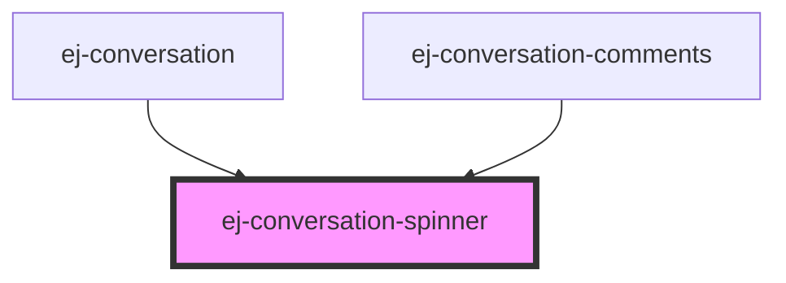

# my-component

<!-- Auto Generated Below -->

## Properties

| Property     | Attribute    | Description | Type     | Default |
| ------------ | ------------ | ----------- | -------- | ------- |
| `background` | `background` |             | `string` | `""`    |

## Dependencies

### Used by

 - [ej-conversation]()
 - [ej-conversation-comments]()

### Graph

----------------------------------------------

*Built with [StencilJS](https://stenciljs.com/)*
